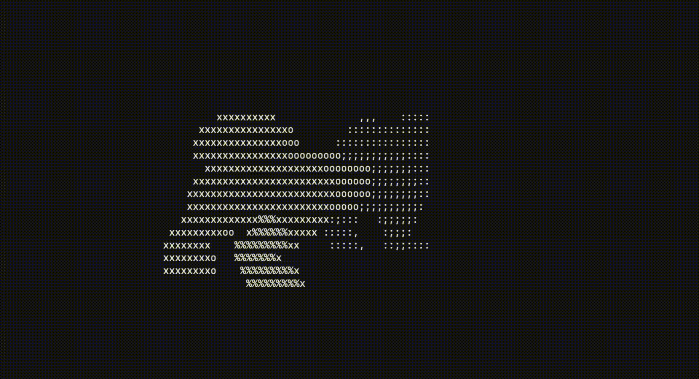

# 3D to ASCII Renderer



a little project that can take a `.obj` file, reads the vertex data, and then turn it into a moving ASCII chars in the terminal.

flow:
the 3d coordinates are extracted from the obj file, and then projected onto a 2D space
```cpp
projectedX = x / z;
projectedY = y / z;

screenX = ((projectedX + 1.0) / 2.0) * width;
screenY = (1.0 - ((projectedY + 1.0) / 2.0)) * height;
```

rotation is handled with using the standard transformation formula:

```cpp
xNew = x * cos(angle) - z * sin(angle);
yNew = y;
zNew = x * sin(angle) + z * cos(angle);
```

and then each projected vertex gets mapped to a terminal cell, and the renderer picks a character based on depth:

```cpp
.,:;ox%#@
```
In case of the web preview or any other graphic library, instead of rendering a char in the terminal cell, we can just basically
render a circle or square as a point and then connect the points via face information using the convex hull extraction formula, and then we can render the points as well as a wireframe onto a 2D plane aka our screen.

run:
```sh
./cppstart.sh path/to/model.obj
```
you can also cap the animation length:
```sh
./cppstart.sh path/to/model.obj --frames 300
```

the main files now live under `src/`:

```text
src/main.cpp       parses args and kicks everything off
src/renderer.cpp   runs the terminal renderer
src/extractor.cpp  reads and prepares the OBJ data
```
